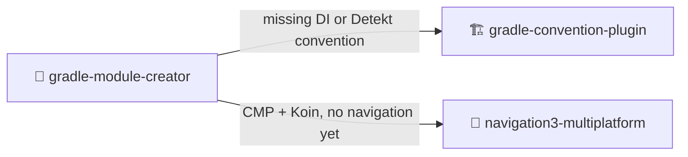

<div align="center">

# 🧰 skills

**Portable agent skills for Kotlin, Android and Compose Multiplatform builds, plus commit messages that read well.**

Plain Markdown, with no runtime and no dependencies. Any agent that can read a file from disk can use them.

[](#-the-catalog)
[](#claude-code)
[](#-gradle-module-creator)
[](#%EF%B8%8F-gradle-convention-plugin)

<sub>Works with</sub><br>


[**Catalog**](#-the-catalog) · [**Parameters**](#-parameters-at-a-glance) · [**How they connect**](#-how-the-skills-connect) · [**Install**](#-install) · [**Write your own**](#-adding-a-skill)

</div>

---

## 📦 The catalog

Each skill is one self-contained `SKILL.md`, which is Markdown with YAML frontmatter. It tells a coding agent when the skill applies, which steps to follow and what the result should be.

| | Skill | What it does | Arguments |
|:-:|---|---|---|
| ✍️ | [**`commit-message`**](#%EF%B8%8F-commit-message) | Writes an emoji-prefixed conventional commit from your diff, and commits only after you approve it | — |
| 🏗️ | [**`gradle-convention-plugin`**](#%EF%B8%8F-gradle-convention-plugin) | Bootstraps `build-logic`, migrates modules onto it, and adds Compose, Koin and Detekt conventions | `compose` · `koin` · `detekt` |
| 🧩 | [**`gradle-module-creator`**](#-gradle-module-creator) | Scaffolds a module and wires it in: build, sources, Compose, DI, Detekt and navigation | free-form request |
| 🧭 | [**`navigation3-multiplatform`**](#-navigation3-multiplatform) | Adds Navigation 3 routing with shared keys and Koin entry providers, and restores the back stack on every host | — |

---

## 🎛 Parameters at a glance

```text
/commit-message
/gradle-convention-plugin   [compose | koin | detekt]
/gradle-module-creator      <what to add, in your own words>
/navigation3-multiplatform
```

> [!TIP]
> You rarely need the slash command. Each skill's `description` lists the phrases that trigger it, such as *"commit this"*, *"every module repeats the same `android { }` block"* or *"add a settings screen"*, so the agent loads the skill when your request matches.

---

### ✍️ `commit-message`

<table>
<tr><td><b>Invoke</b></td><td><code>/commit-message</code> or just say <i>"commit this"</i>, <i>"save my work"</i></td></tr>
<tr><td><b>Arguments</b></td><td>None. The skill reads your staged changes.</td></tr>
<tr><td><b>Output</b></td><td><code>&lt;emoji&gt; &lt;type&gt;: &lt;Short imperative description&gt;.</code></td></tr>
</table>

1. Reads `git diff --cached`. If nothing is staged, it reads the unstaged diff and asks what to stage.
2. Picks the **one** type that matches the main intent of the change.
3. Proposes the message and **waits for your approval** before it commits.

Messages are a single English subject line in the imperative mood, under 72 characters, with no body or footer.

<details>
<summary><b>The ten types</b></summary>
<br>

| Emoji | Type | When |
|:-:|---|---|
| ✨ | `feat` | A real, user-facing feature. Scaffolding and boilerplate don't count. |
| 🐞 | `fix` | Bug fix |
| ♻️ | `refactor` | Restructuring without behavior change |
| 🎨 | `style` | Formatting only |
| 📚 | `docs` | Documentation only |
| 🧪 | `test` | Tests only |
| ⚡ | `perf` | Performance |
| 🛠️ | `build` | Build system or dependencies |
| 🔄 | `ci` | CI/CD configuration |
| ⚙️ | `chore` | Maintenance, config and tooling |

</details>

---

### 🏗️ `gradle-convention-plugin`

> Start with a build where every module repeats the same `android { }`, `compileSdk` and `jvmTarget`. End with one where each module only declares a plugin id and its dependencies.

```text
/gradle-convention-plugin [compose | koin | detekt]
```

| Argument | What it adds |
|---|---|
| `compose` | A Compose convention. It asks you which dependencies to include. |
| `koin` | One Koin compiler convention, with a branch for each module type, Koin startup on each platform, and cleanup of an old KSP setup |
| `detekt` | A build-wide Detekt quality policy that matches your Detekt version |
| *(none)* | `init`: bootstraps `build-logic` and migrates every module onto it |

The skill **surveys the build first**. What it does next depends on the argument and on whether `build-logic` already exists:

| | `build-logic` present | `build-logic` absent |
|---|---|---|
| **With argument** | Goes straight to that convention | **Asks** whether to run `init` first, then continues |
| **No argument** | Lists what the build is missing and **asks** which to add | Runs `init`, then **asks** whether to stop at verify or continue |

> [!IMPORTANT]
> The skill never guesses. A wrong guess adds a plugin class, a catalog entry, a registration and a root `apply false` line, and you would only find out from the diff. If the argument is missing or the scaffold doesn't exist yet, the skill asks before it changes anything.

<details>
<summary><b>The shape it builds</b></summary>
<br>

```text
<root>/
├── settings.gradle.kts              includeBuild("build-logic"), inside pluginManagement
├── build.gradle.kts                 every plugin declared once, all `apply false`
├── gradle/libs.versions.toml        versions, plugin coordinates, and the convention plugin ids
├── build-logic/
│   ├── settings.gradle.kts          its own repositories, and the catalog re-declared
│   └── convention/
│       ├── build.gradle.kts         compileOnly AGP/KGP, plugin registration, catalog accessors
│       └── src/main/kotlin/
│           ├── <Type>ConventionPlugin.kt   one class per module type, default package
│           └── extensions/                 shared internal helpers, where the real work lives
└── <module>/build.gradle.kts        plugins { alias(...) } + dependencies { }, and that is all
```

</details>

<details>
<summary><b>The verify gate</b></summary>
<br>

```bash
./gradlew --stop                            # old daemons keep the old plugin classpath
./gradlew -p build-logic :convention:check  # compiles build-logic, runs validatePlugins
./gradlew help                              # configures every project
./gradlew assemble                          # actually compiles
```

</details>

**Covers:** Android · iOS · JVM/Desktop · JS · Wasm · native targets · AGP 8 and 9

---

### 🧩 `gradle-module-creator`

> The result is a module you can use, already connected to the app. A screen request includes everything a screen needs, unless you opt out of a part.

```text
/gradle-module-creator <what to add>
```

The argument is plain language. The skill works out the role, the name and the consumer module from your repository:

```text
/gradle-module-creator feature account-settings
/gradle-module-creator a core network module
/gradle-module-creator pure-Kotlin domain module for payments
```

| Profile | Build + settings | Compose + preview | DI | Detekt | Navigation |
|---|:-:|:-:|:-:|:-:|:-:|
| **Feature / screen** | ✅ | ✅ | ✅ | ✅ | ✅ |
| **Core UI** | ✅ | ✅ | existing policy | existing policy | if its role needs it |
| **Core / infrastructure** | ✅ | — | existing policy | existing policy | — |
| **Domain / pure Kotlin** | ✅ | — | if compatible | existing policy | — |

<details>
<summary><b>Name resolution</b></summary>
<br>

| From `account-settings` | |
|---|---|
| Types | `AccountSettings` |
| Functions and properties | `accountSettings` |
| Package segment | `accountsettings` (never hyphenated) |
| Project path | Follows the siblings, e.g. `:feature:accountsettings` |

</details>

<details>
<summary><b>A typical Koin + Navigation 3 feature</b></summary>
<br>

```text
<module-dir>/
  build.gradle.kts
  <source-root>/<package-dir>/
    <Name>Module.kt                 # DI module at the package root
    <Screen>Screen.kt               # stateless screen and its preview, one file
    <Screen>EntryProvider.kt        # key → screen, plus the key's serializer
    <Screen>ViewModel.kt            # only when the screen navigates or holds state
    <Screen>Key.kt                  # only when no other module navigates to it
```

</details>

It finishes by compiling the module, its consumer and every host, then runs Detekt on the new module, launches a host and navigates to the new screen.

---

### 🧭 `navigation3-multiplatform`

> Modular Compose Multiplatform routing that keeps the back stack across rotation and process death on Android, iOS, desktop and web.

```text
/navigation3-multiplatform
```

There are no arguments. The skill inspects your modules, targets, Gradle conventions and Koin setup, then adapts its wiring to them.

| Piece | Role |
|---|---|
| `@Serializable` keys implementing `NavKey` | Destinations, visible to both the navigating code and the code that renders them |
| Singleton `Navigator` | Owns the `NavBackStack` and receives it injected, so a restored stack can be handed in |
| `EntryProvider` for each feature | Entry builder + `SerializersModule`, collected by an `EntriesAggregator` |
| `rememberNavigator(startKey)` | Saves the stack polymorphically and restores it through Koin |

| Host | How Koin starts |
|---|---|
| **Android** | `@KoinApplication` `Application` → `startKoin<AppModule>` in `onCreate` |
| **Desktop / Web** | `main()` → `startKoin<AppModule>()` before `application { Window }` / `ComposeViewport` |
| **iOS** | Swift `App` init → `initKoin()` in `iosMain` of `:app` |

> [!NOTE]
> The skill names the shared module `:app` throughout. If a new project generated it as `shared`, the skill suggests renaming it to `:app` and asks before it does.

---

## 🔗 How the skills connect

The skills hand work to each other when part of the setup is missing:



The `gradle-module-creator` plugin installs `gradle-convention-plugin` with it for this reason.

---

## 🚀 Install

Clone the repo once:

```bash
git clone git@github.com:weslley-campos/skills.git ~/skills
```

Then make the skills visible to your agent. An agent finds instructions in one of two ways: it scans a directory, or it always reads a particular file. Symlink skills into that directory, or reference them from that file.

### Claude Code

**Option A: as a plugin marketplace.** Updates are handled for you, and commands are namespaced as `/<plugin>:<skill>`, e.g. `/skill:commit-message`.

```text
/plugin marketplace add weslley-campos/skills
```

| Plugin | Installs | Command |
|---|---|---|
| `skill` | Every skill in this repo | `/plugin install skill@weslley-skills` |
| `commit-message` | `commit-message` | `/plugin install commit-message@weslley-skills` |
| `gradle-convention-plugin` | `gradle-convention-plugin` | `/plugin install gradle-convention-plugin@weslley-skills` |
| `gradle-module-creator` | `gradle-module-creator` + `gradle-convention-plugin` | `/plugin install gradle-module-creator@weslley-skills` |
| `navigation3-multiplatform` | `navigation3-multiplatform` | `/plugin install navigation3-multiplatform@weslley-skills` |

**Option B: symlink into `~/.claude/skills/`.** The command keeps its plain name, `/commit-message`, and edits apply on the next `/reload-skills`.

```bash
ln -s ~/skills/skills/commit-message ~/.claude/skills/commit-message
```

<details>
<summary><b>Codex CLI, Gemini CLI and Copilot</b></summary>
<br>

These agents load Markdown instruction files instead of scanning a skills directory. Reference the skills you want from a file the agent already reads:

```markdown
## Skills

Read and follow the linked file before starting a matching task.

- [commit-message](~/skills/skills/commit-message/SKILL.md) — writing a git
  commit message.
- [gradle-convention-plugin](~/skills/skills/gradle-convention-plugin/SKILL.md)
  — Gradle convention plugins, `build-logic`, deduplicating module config.
- [gradle-module-creator](~/skills/skills/gradle-module-creator/SKILL.md) — adding
  Android, Kotlin/JVM, or Kotlin Multiplatform modules to an existing Gradle build.
- [navigation3-multiplatform](~/skills/skills/navigation3-multiplatform/SKILL.md)
  — modular Compose Multiplatform Navigation 3 routing.
```

| Agent | Global | Per-project |
|---|---|---|
| [Codex CLI](https://developers.openai.com/codex/guides/agents-md) | `~/.codex/AGENTS.md` | `AGENTS.md`, at any directory level |
| [Gemini CLI](https://google-gemini.github.io/gemini-cli/docs/cli/gemini-md.html) | `~/.gemini/GEMINI.md` | `GEMINI.md`, at any directory level |
| [Copilot](https://docs.github.com/copilot/customizing-copilot/adding-custom-instructions-for-github-copilot) | — | `.github/copilot-instructions.md`, `AGENTS.md`, or `.github/instructions/*.instructions.md` |

> [!TIP]
> `AGENTS.md` works for all three. Codex and Copilot read it without configuration, and Gemini CLI reads it once you set `contextFileName` in `.gemini/settings.json`.

All three load these files hierarchically: a file in a subdirectory applies to that subtree and overrides the files above it. That lets you scope a skill to the project or module that needs it. Copilot can also scope a file by glob with `applyTo` frontmatter in `.github/instructions/*.instructions.md`:

```markdown
---
applyTo: "**/*.gradle.kts"
---
```

</details>

<details>
<summary><b>Any other agent</b></summary>
<br>

The same approach works for other agents. Find the directory your agent scans or the file it always reads, then symlink into it or reference from it:

```bash
ln -s ~/skills/skills/commit-message <agent-skills-dir>/commit-message
```

</details>

> [!TIP]
> Symlink or reference the skills rather than copying them. Edits take effect immediately, and one `git pull` updates every agent.

---

## 🛠 Adding a skill

Create a directory under `skills/` with a `SKILL.md` in it:

```text
skills/my-skill/SKILL.md
```

Agents find the skill through its frontmatter. Write the `description` for the model rather than for a person, because it is often the only part an agent reads when deciding whether the skill applies. List the trigger phrases explicitly:

```markdown
---
name: my-skill
description: >
  What the skill does. Use this skill whenever the user says "...", asks to
  ..., or any variation of requesting ....
---

Instructions for the agent go here.
```

Keep the body portable: describe the workflow and the shell commands to run. Don't rely on tools, file layouts or slash commands that only one agent has.

<details>
<summary><b>Claude Code plugin manifest</b></summary>
<br>

`.claude-plugin/marketplace.json` lets the repo also act as a Claude Code plugin marketplace. It is optional, and the other install methods ignore it. The `skill` bundle picks up new directories automatically. To make a skill installable on its own, add an entry and validate it:

```json
{
  "name": "my-skill",
  "description": "What it does",
  "source": "./",
  "strict": false,
  "skills": ["./skills/my-skill"]
}
```

```bash
claude plugin validate .
```

</details>
